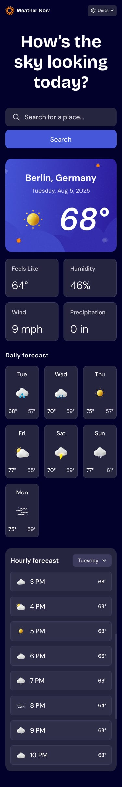

# Weather App 🌦️

*A modern, responsive Weather Application built with HTML, CSS, and JavaScript.
The app provides real-time weather data with a clean UI and smooth user experience across all devices .*

## Live Demo 🚀
*https://weather-app-virid-six-92.vercel.app/*

## Features ✨
* **🌍 Real-time weather data .**  
* **📱 Fully responsive design (Mobile / Tablet / Desktop) .**  
* **🎨 Clean and modern UI .**  
* **⚡ Fast loading performance .**  
* **🔎 Search for any city worldwide .**  
* **🌙 Dynamic weather conditions (icons + background updates) .**  

## Smart Default Location (Important Feature) 🌐
***One of the key features of this project is intelligent initial city detection based on the user's device language.***

*When the app is opened for the first time (before user interaction or confirmation screen appears):*

* **If device language is Arabic → default city is Cairo .**  
* **If device language is English → default city is London .**  
* **Other languages → fallback default city (e.g., New York or a global default) .**  

### Why this matters: 💡
*This improves user experience (UX) by:* 
* **Reducing empty states on first load** . 
* **Showing relevant data immediately** . 
* **Making the app feel “localized” and intelligent** . 

## Technologies Used 🧠
* **HTML5.** 
* **CSS3 (Flexbox / Grid) .**  
* **JavaScript (ES6+) .**  
* **Weather API integration .**  

## Responsive Design 📱
*The UI is designed with a mobile-first approach, ensuring:* 
* **Smooth layout on small screens .**  
* **Optimized spacing and typography .**  
* **Adaptive components for all devices .**  

## Project Structure ⚙️
* **weather-app/**
* **│**
* **├── public/**
* **│   ├── images/**
* **│   ├── icons/**
* **│   └── favicon.ico**
* **│**
* **├── src/**
* **│   │**
* **│   ├── api/**
* **│   │   └── API.js**
* **│   │**
* **│   ├── controllers/**
* **│   │   └── APPcontroller.js**
* **│   │**
* **│   ├── logic/**
* **│   │   └── Logic.js**
* **│   │**
* **│   ├── ui/**
* **│   │   └── UIController.js**
* **│   │**
* **│   ├── tools/**
* **│   │   └── Validator.js**
* **│   │**
* **│   ├── styles/**
* **│   │   ├── base.css**
* **│   │   ├── layout.css**
* **│   │   ├── components.css/**
* **│   │   ├── utilities.css**
* **│   │   └── state.css**
* **│   │**
* **│   │**
* **│   └── main.js**
* **│**
* **├── index.html**
* **└── README.md**

## Screenshots 📸

### Desktop View

### Mobile View

## What I Learned 🎯

* ***Working with APIs and asynchronous JavaScript.***
* ***Handling UI states (loading / success / error).***
* ***Improving UX with smart defaults.***
* ***Responsive design principles.***
* ***Clean project structure.***

## Future Improvements 🚀 
* ***Add hourly forecast charts.***
* ***Save favorite cities.***
* ***Dark mode support.***
* ***Geolocation auto-detection.***
* ***PWA support (installable app).***

## Author 👨‍💻
*Built by a Frontend Developer focused on:*
* **Clean UI/UX.**
* **Responsive design.**
* **Real-world project architecture.**

## License
*This project is licensed under the [MIT License](https://choosealicense.com/) - see the [LICENSE.md](LICENSE) file for details.*